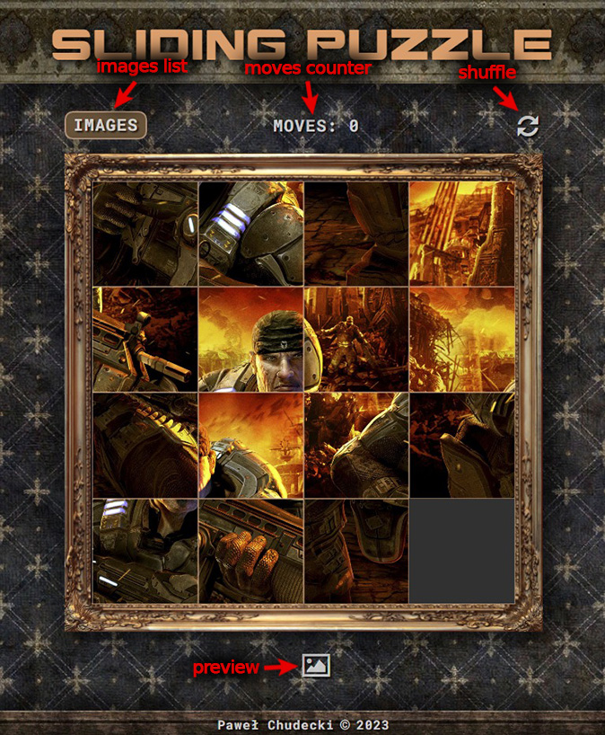
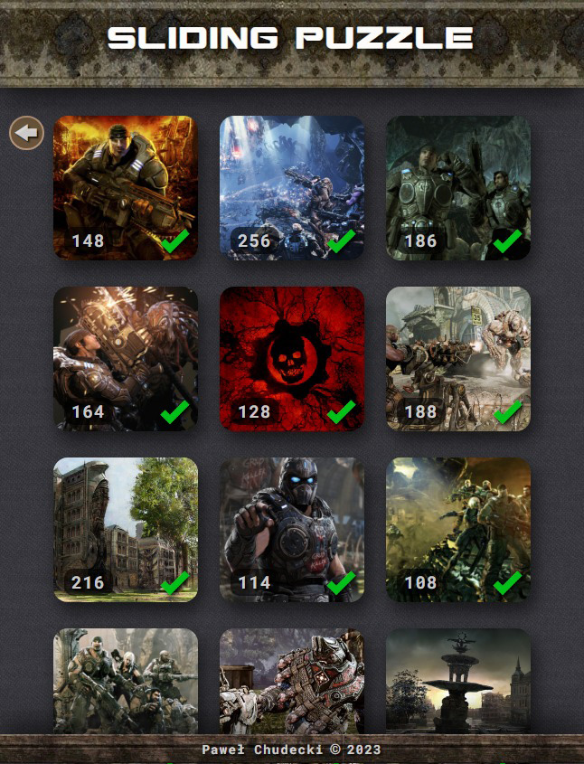

# Sliding-Puzzle
In this mini-game, the player must arrange the picture by moving the tiles, and leaving one empty field in the lower right corner. While solving, you can see a preview by clicking on the button below the image. You can select other images from the list by clicking the image button. After arranging, the number of moves is stored in the browser's local memory and is visible on the picture list screen.
## Link

Link to [Click](https://soulrvr29.github.io/Slider-Puzzle/)

## Screenshots

